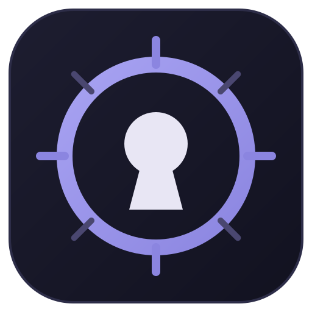

# Keywarden

**A local-first, zero-knowledge password manager for Windows.**
Your passwords, sealed on your own machine. No account. No cloud. No tracking.

[**Download the latest version →**](https://github.com/Skaikru0518/keywarden-releases/releases/latest)

---

## What is Keywarden?

Keywarden keeps your logins, notes, and two-factor secrets encrypted on your device and nowhere else. There is no server to trust and no account to create — the app opens, you unlock it with one master password, and everything else stays local.

It uses **envelope encryption**: your master password derives a key (via Argon2id) that only unwraps a random data key; that data key encrypts every record with XChaCha20-Poly1305. The database and every backup contain ciphertext only. If someone copies your vault file, it is noise without your master password.

## Features

- **Zero-knowledge vault** — every field (even the service name) is encrypted before it touches disk
- **Built-in TOTP** — store 2FA secrets, see live codes with a countdown, or scan them onto your phone via QR
- **Password generator** — random characters or memorable Diceware passphrases, all from a secure RNG
- **Password health** — flags weak and reused passwords, and checks against Have I Been Pwned using k-anonymity (your password never leaves the device)
- **Categories, tags, favorites & search** — organize a large vault and find anything instantly
- **Site icons** — favicons fetched privately, or bring your own image
- **Encrypted backups** — automatic, scheduled, and manual export/import; point them at a synced folder for offsite copies
- **Auto-lock** — on inactivity, and when Windows locks or sleeps
- **Clipboard protection** — copied secrets clear themselves automatically
- **Recovery key** — a one-time key to get back in if you forget your master password
- **Auto-updates** — new versions install themselves in the background
- **Light & dark** — a liquid-glass interface that follows your system theme

## Install

1. Download **`Keywarden-Setup.exe`** from the [latest release](https://github.com/Skaikru0518/keywarden-releases/releases/latest).
2. Run it. Keywarden installs per-user (no admin prompt) and adds Start-menu and desktop shortcuts.
3. Create a vault, set a master password, and **save the recovery key it shows you.**

> [!WARNING]
> Windows SmartScreen may warn on first launch because the installer isn't code-signed yet.
> Click **More info -> Run anyway**. Background updates afterwards are silent.

## Security & privacy

| | |
| --- | --- |
| **Key derivation** | Argon2id (64 MiB, 3 iterations) |
| **Encryption** | XChaCha20-Poly1305 (AEAD), fresh nonce per record |
| **Key model** | Envelope: master password -> KEK -> wraps a random DEK; recovery key is a second wrapping |
| **At rest** | Database and backups hold ciphertext only |
| **Network** | None, except optional favicon fetch and the opt-in breach check (k-anonymity) |
| **Telemetry** | None |

Details and how to report a vulnerability: [SECURITY.md](SECURITY.md).

## FAQ

**Where is my data stored?**
In `%APPDATA%\Keywarden\vault.db` on your machine. Uninstalling the app does not touch it.

**What if I forget my master password?**
Use the recovery key you saved when creating the vault, then set a new master password. Lose both and the data is gone — that is the point of zero-knowledge.

**How do updates work?**
Keywarden checks shortly after launch and hourly. When a newer version is published here, it downloads in the background and offers a one-click restart. Right after a release goes live there is a short propagation delay before clients see it.

**Is it open source?**
The release binaries live here. Issues and feature requests are welcome on this repository.

## What's in a release

| File | Purpose |
| --- | --- |
| `Keywarden-Setup.exe` | The installer you download |
| `RELEASES` | Update manifest read by the auto-updater |
| `keywarden-*-full.nupkg` | Update package used for background updates |

---

Built with Electron, React & libsodium. Made for people who would rather not trust a cloud with their passwords.

